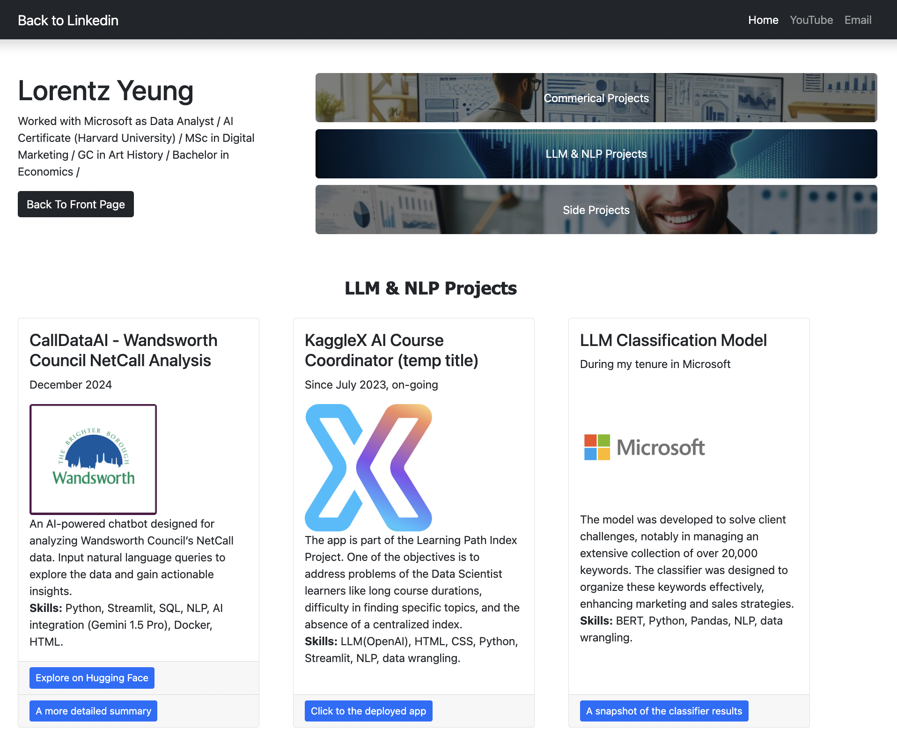

# [Lorentz Yeung's Portfolio](https://entzyeung.github.io/portfolio/side_projects.html)

Welcome to my portfolio! This repository hosts the code for my personal portfolio website, showcasing my skills, projects, and accomplishments across various domains, including data science, machine learning, and natural language processing (NLP).

## 🚀 Features

### 1. **Interactive Navigation**
- A responsive and modern design built with HTML, CSS, and Bootstrap.
- Easy-to-use navigation to explore various sections of the portfolio.

### 2. **Highlighted Sections**
- **Commercial Projects:** Showcasing professional projects that solved real-world business problems.
- **LLM & NLP Projects:** Highlighting my expertise in Large Language Models (LLMs) and NLP applications.
- **Side Projects:** Featuring passion projects and innovative experiments with cutting-edge technologies.

### 3. **Detailed Project Cards**
Each project card includes:
- **Overview:** A concise description of the project.
- **Skills Used:** Highlighted technical tools and methodologies.
- **Links:** Direct access to demos, publications, or additional resources.

### 4. **Interactive Elements**
- **Contact Form:** Users can request more information directly from the website.
- **Dynamic Buttons:** Links to apps, snapshots, and detailed insights.

## 🖼️ Screenshot



## 🛠️ Technologies Used
- **Frontend:** HTML, CSS, Bootstrap
- **Backend Integration:** Formspree for contact form functionality
- **Deployment:** GitHub Pages (or any static site hosting service)

## 📂 Structure
The project structure is as follows:

```
.
├── index.html            # Main landing page
├── commercial_projects.html
├── LLM_NLP_projects.html
├── side_projects.html
├── assets/               # Images, icons, and other assets
│   ├── front/            # Front page assets
│   ├── LLM_NLP_projects/ # Assets for LLM and NLP projects
│   ├── commercial_projects/ # Assets for commercial projects
│   ├── side_projects/    # Assets for side projects
├── css/
│   └── styles.css        # Custom styles for the website
├── js/
│   └── scripts.js        # JavaScript for interactivity
└── README.md             # Project documentation
```

## 🌟 Highlights
### Featured Projects

#### 1. **CallDataAI - Wandsworth Council NetCall Analysis**
- Built an AI-powered chatbot to analyze NetCall data and provide actionable insights.
- **Skills:** Python, Streamlit, SQL, NLP, Docker.
- [Explore the Project](https://huggingface.co/spaces/Entz/council_2)

#### 2. **Sales Forecast for a Fast-Moving-Fashion Online Shop**
- Developed a sales forecasting model incorporating festive events and marketing strategies.
- **Skills:** Time Series Forecasting, Python, Data Visualization.
- [View Snapshot](assets/commercial_projects/iosphere_sales_forecast_demo.png)

#### 3. **Automated London Property Price Analysis**
- Created automated monthly reports for property price analysis with Python.
- Reduced analysis time by 98%.
- [Archive of Reports](https://positivehk-com.translate.goog/2022/05/12/2022年英國物業價格分析下載/?_x_tr_sl=auto&_x_tr_tl=zh-TW&_x_tr_hl=zh-TW)

## 📬 Contact
If you have any questions or would like to collaborate, feel free to reach out:

- **Email:** lorentzyeung@gmail.com
- **LinkedIn:** [Lorentz Yeung](https://www.linkedin.com/in/lorentzyeung/details/featured/)

---

Thank you for visiting my portfolio! 🎉
